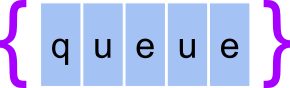

<p align="center">
  
</p>

<p align="center">A simple broker API</p>

[](https://circleci.com/gh/pedrohml/queuejs/tree/main)

## Description

The **queuejs** is a simple broker API for dummy purposes.

## Design

The API was designed to interact with **producer** and **consumer** http clients.

To see the endpoints documentation go [here](./docs/endpoints.md)
### Dependencies
- [NestJS](https://nestjs.com) for API abstraction;
- [Prisma](https://www.prisma.io) for database abstration;
- [async-lock](https://www.npmjs.com/package/async-lock) for concurrency management;
- [PostgreSQL](https://www.postgresql.org) for database engine on production environment;
- [SQLite](https://www.sqlite.org/index.html) for database engine on development/test environments;
- [Swagger](https://swagger.io) for API documentation;

## Running with docker (if you are hurry !)

```bash
$ docker-compose up --build
```

To see API endpoints go to https://localhost:3000/api (Swagger UI)

## Running locally

Before running the code locally, we need to prepare the enviroment.

### Prepare

```bash
# install dependencies
$ npm install

# create the database structure (sqlite)
$ npm run pushdb:dev

# generate database abstractions
$ npm run pgenerate:dev
```

### Running

Make sure you have [prepared the environment](#Prepare).

```bash
# development
$ npm run start

# watch mode (hot reload)
$ npm run start:dev
```

To see API endpoints go to https://localhost:3000/api (Swagger UI)

### Testing

Make sure you have [prepared the environment](#Prepare).

```bash
# create the database structure for integration test (sqlite)
$ npm run pushdb:test

# unit tests
$ npm run test

# e2e tests
$ npm run test:e2e
```

## Tools

Some standalone implementations for **producer** and **consumer** are provided.

Currently, the consumer implements *at-most-once* approach to handle messages.

Example:
  1. Make sure **queuejs** is running at `localhost:3000`;
  2. Produce 3 messages (or [messages.txt](./tools/messages.txt?raw=true)): `echo -e 'message1\nmessage2\nmessage3' | node tools/producer.js -t topic1`
  ```
message1 OK
message2 OK
message3 OK
  ```
  3. Consume 3 messages: `node tools/consumer.js -t topic1 -w`:
  ```
[ { topic: 'topic1', data: 'message1', offset: 1 } ]
[ { topic: 'topic1', data: 'message3', offset: 2 } ]
[ { topic: 'topic1', data: 'message2', offset: 3 } ]
  ```

### **tools/producer.js**

```
$ node tools/producer.js --help

Usage: producer.js [options]

produce a message for each stdin line to queuejs

Options:
  -h, --host <host>     The host for queuejs (default: localhost) (default: "localhost")
  -p, --port <port>     The port for queuejs (default: 3000) (default: "3000")
  -t, --topic <topic>  topic to produce messages
```

### **tools/consumer.js**

```
$ node tools/consumer.js --help

Usage: consumer.js [options]

consume messages from queuejs and write to stdout

Options:
  -h, --host <host>    The host for queuejs (default: "localhost")
  -p, --port <port>    The port for queuejs (default: "3000")
  -g, --group <group>  The consumer group to be used
  -t, --topic <topic>  topic to produce messages
  -w, --watch          Keep listening for new messages (default: false)
```

## Limitations

This API is not supposed to have multiple instances by database.
So scaling horizontally is not an option now.

## Backlog

1. Improve the [API](./tools/api.js) client library and documentation;
2. Add support to reset consumer group offset;
3. Migrate atomic operations (i.e. produce, commit and consume) to PostgreSQL procedures;
4. Add partition key support.
